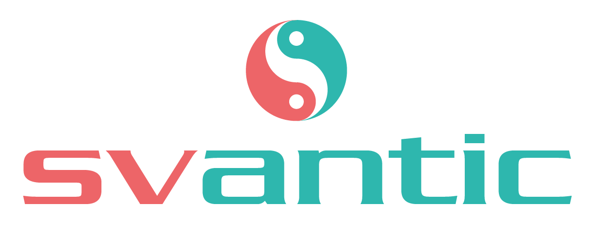

<p style="text-align:center">
  
  <br>
  <a href="https://www.npmjs.com/package/svantic">
    
  </a>
  <a href="https://github.com/ryu-man/svantic/blob/main/LICENSE">
    
  </a>
</p>
<br>

Svantic is a set of UI components for [Svelte](https://svelte.dev) based on the [Fomantic-UI](http://fomantic-ui.com) library.

## Documentation

-- Coming soon --

## Installation

```bash
# npm
npm install svantic
# yarn
yarn add svantic
```

## Quick start with new project

Create a new project based on [sveltejs/template](https://github.com/sveltejs/template)

```bash
npx degit sveltejs/template svantic-app
cd svantic-app
# npm
npm install
# yarn
yarn install
```

Or you can use our [svantic template](https://github.com/ryu-man/svantic-template), it comes pre-configured

```bash
npx degit ryu-man/svantic-template#main svantic-app
cd svantic-app
# npm
npm install
# yarn
yarn install
```
<!-- Or you can our svantic-template -->

_NOTE: There are of course other ways to set up a project using svelte. This is just the quickest way to start._

### Rollup Configuration

Because svantic uses dymanic import for better footprint and performance you have to configure rollup as following:

```js

output: {
  ...,
  dir: "path to output directory",
  entryFileNames: "index.js",
  chunkFileNames: "[name].js"
},
  
```

## Usage

Add svantic and modify `src/App.svelte` file in the following way

```html
<script>
  // import any components you want
  import { Button } from 'svantic'

</script>

<Button >Hello world</Button>
```

```html
<script>
    // import modules
    import { Dropdown } from 'svantic';

</script>

// Every module have two props: onMount{function} and setting{object}

// onMount function: allows control module behaviors
// settings: pass module settings
<Dropdown selection onMount={(controller) => {}} settings={{}}>
	<Icon name="caret down" />
	<Dropdown.text>Select language</Dropdown.text>
	<Dropdown.menu>
		<Dropdown.item>English</Dropdown.item>
		<Dropdown.item>Arabic</Dropdown.item>
		<Dropdown.item>Spanish</Dropdown.item>
		<Dropdown.item>German</Dropdown.item>
	</Dropdown.menu>
</Dropdown>
```

...then start [Rollup](https://rollupjs.org/)

```bash
npm run dev
```

Navigate to [localhost:5000](http://localhost:5000)

## Development

1. Clone this repo: `git clone https://github.com/ryu-man/svantic.git`
2. Install dependencies: `npm i`
3. Start building fomantic: `npm run build:fomantic`
4. Start the automated build: `npm run build`
5. Open url that console prints in your browser

## License

Code released under [MIT license](./Licence)

Copyright &copy; - ryu-man.
